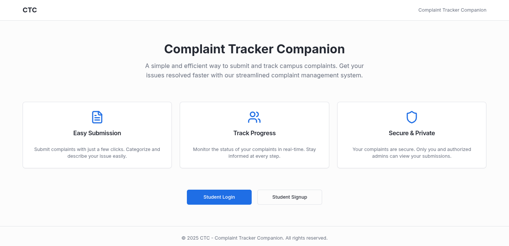
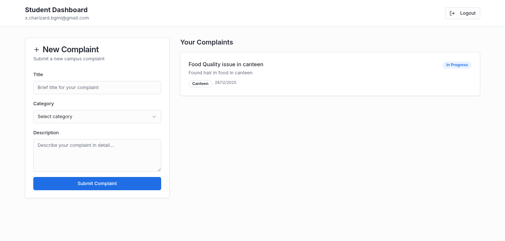
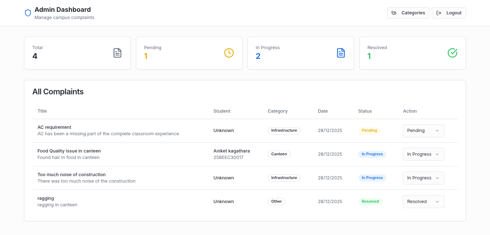

# 📌 Complaint Tracker Companion

A web‑based platform that allows students to **report campus issues** and enables college authorities to **view, manage, and resolve complaints efficiently.**

---

## 🧠 Problem Statement
Colleges lack a simple and centralized platform for students to report issues and for authorities to track resolutions transparently.

---

## 🎯 Objectives
- Provide students an easy way to submit complaints  
- Help authorities view, manage, and update complaint status  
- Improve communication and problem‑resolution efficiency on campus  

---

## ✨ Features
- 🔐 Student Login / Signup  
- 📝 Complaint submission  
- 📊 Student dashboard (view submitted complaints)  
- 👨‍💼 Admin login  
- 🗂 Admin dashboard with complaint list  
- 🔄 Status toggle (Pending → Solved)

---

## 🛠 Tech Stack

**Frontend**
- HTML  
- CSS  
- JavaScript  
- TypeScript  

**Backend**
- Node.js  
- Supabase (Auth + Database)

**Hosting**
- (Add when deployed — e.g., Vercel / Netlify)

---

## 🏗 Architecture (Overview)

Client (Browser)  
⬇  
Application Logic (JS / TS)  
⬇  
Supabase (Authentication + Database)  
⬇  
Admin Dashboard for complaint management

---

## 🚀 How to Run Locally

```bash
# Clone the repository
git clone https://github.com/AniketKagathara/Complaint-tracker-companion
cd Complaint-tracker-companion
npm install
npm run dev
```






# Open project
cd complaint-tracker-companion
